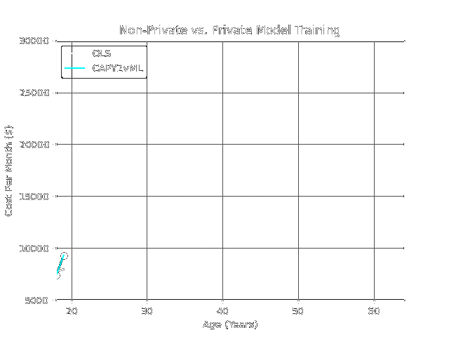

[install-rust]: https://doc.rust-lang.org/cargo/getting-started/installation.html
# Computational Attestations of Polynomial Integrity Towards Verifiable Machine Learning

This project conducts differentially-private machine learning, ultimately producing both a model which can be readily used in a MLaaS setting, and a quantum-secure, non-interactive cryptographic proof that the program was executed honestly. It is derived from the RISC-Zero starter template.

To better understand the concepts behind this template, check out the [Structure of a zkVM Application] explainer.

## Getting Started

Make sure you have the required dependencies:
```bash
sudo apt install curl build-essential libssl-dev pkgconf
```

[install
Rust][install-rust] if you don't already have it, then install the `cargo
risczero` tool:
```
cargo install cargo-risczero
```

Next we'll need to install the `risc0` toolchain with:
```
cargo risczero install
```

## Quick Start

First, make sure [rustup](https://rustup.rs) is installed. This project uses a [nightly](https://doc.rust-lang.org/book/appendix-07-nightly-rust.html) version of [Rust](https://doc.rust-lang.org/book/ch01-01-installation.html). The [`rust-toolchain`](rust-toolchain) file will be used by `cargo` to automatically install the correct version.

The following command reads an (x,y) dataset from the csv included with this repo. 

```
cargo run --release
```

Or, if you have CUDA and a GPU available:
```
cargo run -F cuda --release
```
Expect a lengthy, one-time build process when running with CUDA for the first time.

It processes the dataset into a vector, initializes the prover/guest, and commits the dataset to the guest environment. Following training, a "receipt" is produced which verifies the integrity of the computation. The receipt is zero-knowledge, and together with the differentially-private model, nothing is revealed about the training data.

DP Training Converges to Expected Model:



## Video Walkthrough
[CAPY2vML DP-Training Codebase Walkthrough](https://www.youtube.com/watch?v=o1dhu7udVsc&list=PLhWN89QoP265Mo0ddRCYVGepb6k946-E1)

[Structure of a zkVM Application]: https://dev.risczero.com/zkvm/developer-guide/zkvm-app-structure
